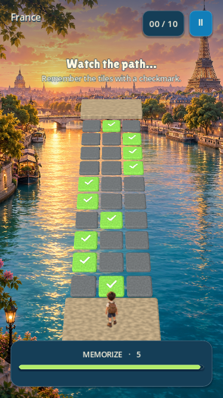

# Passport Run

A playable **Godot 4.5.2 / GDScript memory adventure**, built from `spec.md` and the two supplied image references. iPhone is the first mobile test target. Offline play works independently; optional competition uses the local Convex backend.

**Continuing agent: read [HANDOFF.md](HANDOFF.md) first.** It covers user decisions, everything implemented, remaining milestones, file ownership, tests, and the next work in order.

## Play

1. Install Godot 4.5.2 (standard edition).
2. Import `project.godot` and press **F5**.
3. Try **Learn the Path**, choose your starting country once and select a difficulty, then start a mode.
4. Remember the checked tiles during preview. When they disappear, choose a tile in the next row within 10 seconds. Landing safely resets the clock; pauses and jumps freeze it.
5. Retry after falling to replay the same path. Infinite also offers a new path. Pause or Escape suspends the run; End Run returns to the menu.

Modes: **World Tour**, **Infinite Memory**, **Daily World Tour**, and **Kids Adventure**. The game has 250 free countries and territories, a separately purchased 24-destination Special Expeditions route (16 landmarks plus eight fantasy worlds), and an independently purchased eight-destination Cinema Worlds route. Total passport coverage: 282 destinations. Ranked Daily retains its immutable 197-country catalog. It includes Dubai under the United Arab Emirates, a persistent passport/history, local records, accessibility/audio settings, manually shared challenge codes, and locally exported share cards.



The current visuals use generated photorealistic destination scenery, human explorer sprites, latex balloons, brass equipment and textured 3D path stones. See [current graphics and asset prompts](docs/realistic-graphics.md); the earlier illustrated pass is documented in [visual assets and animation limits](docs/visual-assets.md). Audio uses original destination-specific instrumental loops with layered arrangements and smooth transitions. Country/theme stones, gentle curves, bridge details, elevation, and character pressure reactions add variety. Find saved daily goals under DAILY TRAVEL MISSIONS, and earned keepsakes under MY PASSPORT → MY SOUVENIRS. Thinking/jumping/falling character poses, country celebration with a passport-stamping sequence, photographic travel, Kids stickers/facts and share cards are included. Authenticated server manifests, replay-verified rankings and passport discovery sync work against a real local Convex backend; see [backend setup](backend/README.md). Online buttons appear only when a backend URL is configured. Hosted deployment, ads, live App Store product setup, public challenge URLs, native sharing and device acceptance remain unfinished.

## Checks

```sh
GODOT_BIN=/path/to/godot ./tools/check.sh
```

On macOS:

```sh
GODOT_BIN=/Applications/Godot.app/Contents/MacOS/Godot ./tools/check.sh
```

Tests import a fresh project first, then check the core game, actual touch-event dispatch, complete/fail/retry, local saves and recovery, seed compatibility, routes, mode transitions, and bounded infinite streaming. They use separate test profiles.

Rendered QA and screenshots:

```sh
godot --path . --script tests/test_modes.gd
godot --path . --script tests/test_modes.gd -- --size=390x844
godot --path . --script tests/test_modes.gd -- --size=375x667
```

Summarize a local gameplay log:

```sh
python3 tools/summarize_events.py '/path/to/Godot/user/data/profile.json.events'
```

The report covers the last 500 local events; it is not a population retention dashboard. In-game desktop Settings can open the user data folder.

## Run on the iPhone

The user confirmed access to a Mac and physical iPhone. On the Mac:

1. Install Godot 4.5.2's matching export templates via **Editor → Manage Export Templates**.
2. Use the included **iPhone** export preset. It uses the verified local development Team ID and `com.serhansari.passportrun`; replace these for another developer account.
3. Export to an empty folder outside the source tree, using a filename such as `PassportRun` without spaces.
4. Open the exported Xcode project, configure signing, choose the connected iPhone, and build/run.
5. Check safe areas, one-handed taps, all difficulty previews, repeated retries/transitions, frame time, audio, and background/resume behavior.

No private signing credentials are committed. Godot export and unsigned Xcode compilation succeeded on this Mac. See the [official Godot iOS export instructions](https://docs.godotengine.org/en/stable/tutorials/export/exporting_for_ios.html) and [current iPhone validation status](docs/iphone-validation.md) for device/signing evidence.

## Useful files

- [Agent handoff](HANDOFF.md)
- [Milestone status and test evidence](docs/build-status.md)
- [Original specification](spec.md)
- `resources/` — difficulty tuning
- `scripts/core/` — game state, progression, save/challenge contracts
- `scripts/game/` — playable scene and temporary 3D/audio assets
- `scripts/ui/` — menu, HUD and share card
- `artifacts/` — rendered screenshots; excluded from runtime imports

Destination coverage, unique artwork, data attribution and update instructions: [world destinations](docs/destinations.md).

New games memorize the path for **3 seconds**. Infinite has its own dreamscape. **WORLD MAP** pins cleared countries, and **MY PASSPORT** shows stamped photo pages with navigation/search. Earlier challenges retain their original preview timing. See [map and passport notes](docs/world-map.md).

**SHORT ADVENTURES** offers three-country trips with finish badges. **COLLECTION GOALS** unlocks cosmetic passport covers as you collect countries. Correct-jump streaks add rising notes and visual feedback; failures reveal the missed tile. Scenery has subtle motion, and the world map tracks regional completion. These rewards preserve gameplay and competitive scoring.

Your standing stone progressively cracks during the ten-second decision window. Timeout collapses the entire occupied row, including the starting platform before the first jump. Landing gives the new stone a fresh timer.

## Latest additions

Adventure Play adds ice, moving bridges and low-gravity/buoyant jumps. MY TRAVEL ROOM and WARDROBE save earned decorations and cosmetics. Friend challenge links include a local ghost replay; cinematic arrivals introduce adventure and paid destinations. See [handoff](HANDOFF.md) for verification and limits.

For the iPhone project with challenge-link support, run `python3 tools/export_iphone.py /private/tmp/passport-native-realistic`. Device testing is deferred to you.

## Balloon Tour

Choose **BALLOON TOUR · ARCADE** from the main menu. Move with arrows or A/D and fire with Space; on phone, hold ◀/▶ and FIRE together. Split and clear every balloon in three rounds to stamp a destination. World, Special and Cinema tours reuse each destination's unique background and music; paid routes retain their pack gates. Choose your free-tour starting country once; the saved choice is permanent. The game assigns a stable route that does not change with difficulty. Balloon tours save the current round, timer, balloons, shots, score, coins, upgrades and co-op state locally, and reopen paused. Checkpoints are written every two seconds and on pause, background, menu exit or normal close. A forced process kill can lose the latest two seconds. Older profiles without a checkpoint resume at the first uncleared passport stamp. Future stops are hidden on the tour map, and the next background appears only after all three rounds at the current stop are cleared. Undiscovered destinations have no scenery preview in pack menus. **WORLD MAP** now links pins in recent travel order. Arcade scores are local and separate from memory-game rankings.

## Expanded mystery arcade — 2026-10-03

Balloon Tour now has walking, upward throwing, blaster recoil and hit/falling/death poses. Death plays before retry; pause freezes it. Eight weapons include the basic wire, double/triple arrows, ceiling-sticking harpoon, rapid blaster, spread shot, piercing laser and splash rocket. Special weapons last 18 seconds. All 22 drop outcomes share the same question-mark appearance until collected. Helpful drops include rapid fire, freeze, slow balloons, quick boots, weapon upgrades, time, coins, bomb and magnet; hazards include faster/multiplied balloons, heavy boots, reversed controls, a short weapon jam and lost time. Multiplication caps its immediate wave at 40 balloons; splitting descendants can increase that count. Rounds use 85/80/75 seconds by difficulty, with speed and balloon count increasing along the tour. Combo points and burst particles provide feedback. Existing destination artwork, music, passport stamps and paid-route gates remain integrated. Screenshots: `artifacts/arcade-rich-*.png`. Physical-device testing remains pending.

Balloon Tour includes destination physics, three challenge types, armored bosses, weapon upgrades/combinations, mystery drop risk bonuses and local shared-screen co-op. Choose LOCAL CO-OP before START; P2 uses J/L + K or the second touch row. One balloon touch ends the round in solo or co-op, including contact with a frozen balloon.

## Arcade return loop — 2026-10-03

Balloon bursts now throw larger radial particles; weapons have distinct synthesized firing cues, armor flashes on hits, and gentle arena shake respects Reduced Motion. Balloon markers identify zigzag (Z), armor (A), five-second splitting (5) and arrow dodging (D).

Pops, clears and coin drops earn **tour coins**. After the passport-stamp animation, NEXT DESTINATION opens Travel Supplies: round time boost (30; +8 seconds to clear or eight seconds shorter survival), two-second starting freeze (25), or a starting weapon (40). Supplies apply in each round, including retries; failed rounds roll back coins and score earned in that attempt. Coins and supplies persist separately for each saved tour. Choose safe conditions for a free starting freeze or harder conditions for faster armored balloons and double pop coins; the destination route stays fixed. Travel first shows a generic mystery silhouette, then reveals the next location after a short flight. Reduced Motion shortens the transition.

**DAILY ARCADE** offers one free destination with three rounds, a seeded starting weapon and balloon modifier shared by everyone on the UTC date. Timing, speed and boss health use fixed Moderate tuning independent of settings. Daily solo records are saved per date, separate from ordinary arcade and memory rankings. This is an offline challenge, without a hosted leaderboard.

Co-op firing uses independent cooldowns. Four pairs of shots within 0.25 seconds charge an automatic **TEAM BURST** that hits every balloon, briefly freezes survivors and awards 300 points. The HUD shows charge progress.

Balloon tours progressively increase difficulty: each destination increases balloon speed and tightens the clear timer; every four destinations adds another opening balloon (up to six). Bosses gain health every three destinations (up to twelve extra hits), and reinforcements arrive more frequently. Rounds also increase speed within each destination. The HUD shows the current level; retries retain its difficulty. Daily Arcade keeps fixed shared rules.

Daily, short-trip, imported-challenge and standalone entries only open destinations already reached or the current guided stop. Ranked daily routes keep their original manifests and remain locked until all their stops are accessible. Purchasing a pack opens its guided route, while future scenery stays hidden. Touch controls have 72-pixel targets, a wider separate firing area, held-state feedback and movement-thumb sliding without releasing the firing thumb. Mobile haptics respect the Settings toggle; their physical feel still needs device testing. Regression coverage: `tests/test_arcade_continuity.gd`.

Balloon deaths expose **RETRY ROUND** immediately, even while the death pose plays. Tap it or press R, Space or Enter to restart with the original round score/coin baseline. Resuming live gameplay shows a three-second countdown; balloons, projectiles, timers, effects and boss warnings stay frozen until it finishes. Backgrounding the countdown returns to pause, then starts a fresh countdown when resumed.

Boss armor thresholds and reinforcement waves show a yellow ring, minion markers and a charge-direction arrow before attacking. The 0.85-second warning freezes with gameplay and survives saved-round recovery. Defeating the boss cancels its pending attacks; remaining minions still need clearing. Reduced Motion keeps the warning steady.

Under **BALLOON TOUR → PRACTICE VISITED DESTINATIONS**, replay any stamped destination in three rounds. Paid scenery retains its pack gate. Practice uses separate local records and never changes the journey checkpoint, passport history, missions, tour coins or achievements. First Clean Boss (a destination without a failed round), 100 Pops (lifetime tour-attempt pops) and No Drops Collected (all three rounds without a mystery pickup) unlock three outfit colors in the existing Explorer wardrobe. Find progress under **BALLOON ACHIEVEMENTS**. Previously saved rounds remain compatible; an old save cannot retroactively prove a no-drops clear. Personal-best feedback compares against the previous record for the same mode and difficulty; retries establish a new comparison after saving the failed attempt's record. Verification and rendered examples: `tests/test_arcade_features.gd`, `artifacts/arcade-features-*.png`.

## Destination mastery and realistic graphics — 2026-10-03

Balloon bosses rotate between warned sweep charges, high bounces and summoner waves. Every destination result reports active play time across all three rounds and failed attempts, retries, best combo, pops and destination points. Gold requires at most 150 seconds, no retry and a five-pop combo; Silver requires at most 210 seconds, at most two retries and a three-pop combo. Other clears earn Bronze. The best medal persists separately for each difficulty and solo/co-op. Older saves retain progress but cannot establish Silver/Gold without complete timing data.

**BALLOON DAILY GOALS** tracks 30 pops, one defeated boss and one destination cleared without collecting drops; goals reset at UTC midnight. **MYSTERY-DROP JOURNAL** reveals an effect only after its drop is collected during a tour. **DESTINATION MASTERY** shows medals for stamped places. Practice remains separate from these saved rewards. Pause or Settings can put FIRE on the left and enlarge touch targets from 72 to 88 pixels; preferences persist.

The graphics pass supplies separate photorealistic scenery for all 282 destinations, realistic side-profile arcade and front-facing jumping-game explorer animation, latex balloons, armored brass bosses, sealed mystery capsules, weapon sprites, metal medals, natural path materials and new menu/Infinite scenery. The character remains planted and side-facing during arcade walking and turns. Next-stop scenery still stays hidden until the current destination is cleared. Assets are generated imagery, and the game remains a 2D/3D hybrid. See [asset inventory, exact prompts and verification](docs/realistic-graphics.md). Physical iPhone visual/performance acceptance remains pending.
